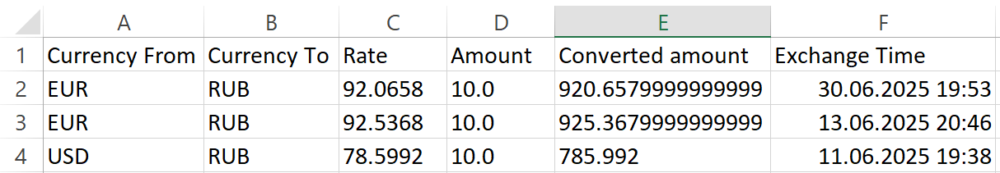

# 💱 FastAPI Currency Exchange


FastAPI Currency Exchange — учебный проект, созданный на базе web-фреймворка FastAPI.

Проект реализует конвертацию валют с использованием внешнего API, а также предоставляет удобный интерфейс для взаимодействия через REST API.

Аутентификация пользователей осуществляется с помощью JWT-токенов.

Поддерживается:

- хранение истории операций,
- экспорт данных в csv формат,
- выполнение фоновых задач с помощью Celery и Redis.

---

## 🧰 Стек технологий

- ⚡ **FastAPI** — основной web-фреймворк
- 🐘 **PostgreSQL** — реляционная СУБД
- 🔐 **Pydantic** — строгая валидация входящих и исходящих данных
- ⚙️ **Pydantic Settings** — работа с переменными окружения
- 🧬 **SQLAlchemy** — ORM для взаимодействия с базой данных
- 🏗 **Alembic** — управление и применение миграций схем базы данных
- 🎯 **Celery** — выполнение фоновых задач
- 🚀 **Redis** — брокер сообщений для Celery и кэш для хранения курсов валют
- 🌐 **Uvicorn** — ASGI-сервер для запуска FastAPI-приложения
- 🐳 **Docker** — контейнеризация приложения и сервисов для упрощённого развертывания и управления окружением

---

## ⚙️ Фоновые задачи с Celery и Redis

В проекте для выполнения периодических задач используется Celery. Это позволяет:

- Периодически обновлять курсы валют в фоне, не замедляя работу API
- Выполнять повторные попытки при сбоях и контролировать количество попыток
- Легко масштабировать обработку задач, запуская несколько воркеров

В качестве брокера сообщений и кэша используется Redis, который обеспечивает быстрый обмен сообщениями между приложением и воркерами Celery.

---

## Основные функции

### `/currency/definitely`

**Метод:** `POST`

**Описание:** Конвертация валюты из одной в другую. Также возвращает актуальный курс обмена между двумя валютами.

**Пример запроса (JSON):**

```
{
  "currency_from": "USD",
  "currency_to": "RUB"
}
```

**Пример ответа (JSON):**

```
{
  "currency_from": "USD",
  "currency_to": "RUB",
  "conversion_rate": 78.5336
}
```

---

### `/currency/list`

**Метод:** `GET`

**Описание:** возвращает список курсов валют по отношению к конкретной валюте. Передача базовой валюты осуществляется через параметр запроса.

**Пример запроса (JSON)**

```
/currency/list?currency_from=USD
```


**Пример ответа (JSON):**

```
{
  "currency_from": "USD",
  "conversion_rates": {
    "USD": 1,
    "AED": 3.6725,
    "AFN": 70.458,
    "ALL": 83.8408,
    "AMD": 384.6016,
    "ANG": 1.79,
    "AOA": 919.7598,
    "ARS": 1189.83,
    "AUD": 1.5308,
    "AWG": 1.79,
    "AZN": 1.7011,
    "BAM": 1.668,
    }
}
```

---

### `/currency/amount`

**Метод:** `POST`

**Описание:** Конвертирует определенное количество валюты из одной в другую. Сохраняет данные конвертации в базу данных.

**Пример запроса (JSON):**

```
{
  "currency_from": "EUR",
  "currency_to": "RUB",
  "amount": 10
}
```

**Пример ответа (JSON):**

```
{
  "currency_from": "EUR",
  "currency_to": "RUB",
  "converted_amount": 920.6579999999999
}
```

---

### `/currency/history`

**Метод:** `GET`

**Описание:** Возвращает список истории конвертации валют авторизованного пользователя.

**Пример запроса (JSON):**

```
/currency/history
```

**Пример ответа (JSON):**

```
[
  {
    "base_currency": "EUR",
    "target_currency": "RUB",
    "rate": 92.0658,
    "amount": 10,
    "converted_amount": 920.6579999999999,
    "exchange_time": "25.06.2025 19:53"
  }
]
```

---

### `/currency/export`

**Метод:** `GET`

**Описание:** Экспортирует историю конвертаций валют в csv формат.

**Пример запроса (JSON):**

```
/currency/history/export?format=csv
```

**Пример ответа (Excel файл):**



---

## 📚 Сводка API

| Метод | Эндпоинт               | Описание                                  |
|-------|------------------------|-------------------------------------------|
| POST  | `/currency/definitely` | Конвертация валют и получение курса       |
| GET   | `/currency/list`       | Список курсов валют по базовой валюте     |
| POST  | `/currency/amount`     | Конвертация суммы и сохранение в БД       |
| GET   | `/currency/history`    | История операций текущего пользователя    |
| GET   | `/currency/export`     | Экспорт истории в файл (CSV)        |

---

## Автор

[github.com/legac1x](https://github.com/legac1x)

Почта: zaharshashev2@gmail.com

---

## Развёртывание

### 🐳 Быстрый старт с Docker (рекомендуется)

#### Это самый простой и надежный способ развернуть проект локально.

**1. Поднимаем контейнеры в фоне**

```
docker-compose up -d --build
```

**2. Применяем миграции внутри контейнера web**

```
docker-compose exec web alembic upgrade head
```

**3. Перезапускаем контейнеры в обычном режиме (с выводом логов в консоль)**

```
docker-compose up --build
```

- На первом шаге мы поднимаем контейнеры в фоне, чтобы подготовить окружение и выполнить миграции.
- На третьем шаге запускаем контейнеры с выводом логов, чтобы видеть работу приложения и отлавливать ошибки.

Переменные окружения настраиваются через ```.env```, пример можно найти в ```.env.example```.

### 🛠️ Развертывание вручную

**1. Установить Python 3.12+**
   Убедитесь, что у вас установлен Python версии 3.12 или новее.
   Если нет, скачайте и установите его с официального сайта: [Python.org](https://www.python.org/).

**2. Создать виртуальное окружение**
   Выполните команду в терминале:
   ```
   python -m venv <название_виртуального_окружения>
   ```

**3. Активировать виртуальное окружение**

**Windows**

```<название виртуального окружения>\Scripts\Activate```

**Linux/macOS**

```source <название виртуального окружения>/bin/activate```

**4. Установить зависимости**

```
pip install -r requirements.txt
```

**5. Настройки переменные окружения**

Создайте файл ```.env``` в соответствии с .env.example.
Получите API ключ с сайта [Exchange Rate API](https://www.exchangerate-api.com/)

Cгенерируйте криптографически безопасный случайный ключ в hex-формате с помощью команды

```bash
openssl rand -hex 32
```

**6. Настройка PostgreSQL**

psql создайте:
- Пользователя:
```sql
CREATE USER <your_username> WITH PASSWORD '<your_password>';
```
- Базу данных:
```sql
CREATE DATABASE <db_name> OWNER <your_username>;
```

Добавьте параметры DB_USER, DB_PASS, DB_NAME в соответствии с ```.env.example```.

**7. Применить миграции**

```
alembic upgrade head
```

**8. Запустить redis сервер в Ubuntu командой**

```bash
redis-server
```

**9. Запустить Worker Celery**

**На windows**

```
celery -A app.celery_app worker --pool=solo --loglevel=info
```

**На Linux/macOS**

```
celery -A app.celery_app worker --loglevel=info
```


**10. Запустить Celery Beat**

```
celery -A app.celery_app beat --loglevel=info
```

**11. Запустить сервер**

```
uvicorn main:app --reload
```